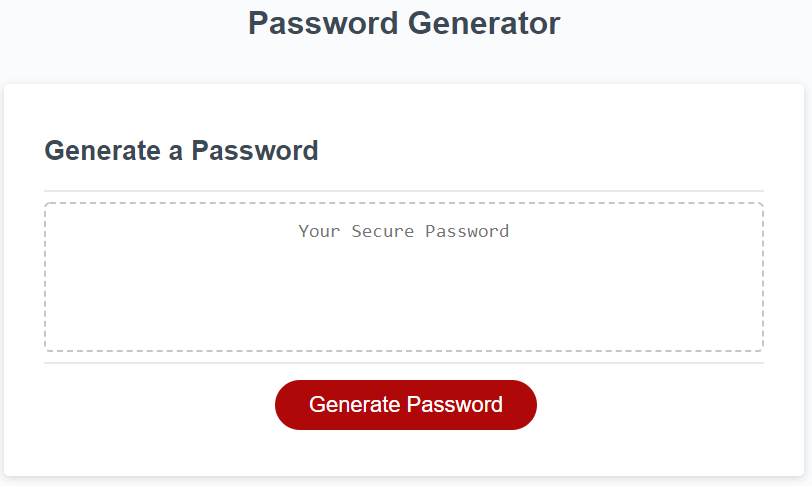
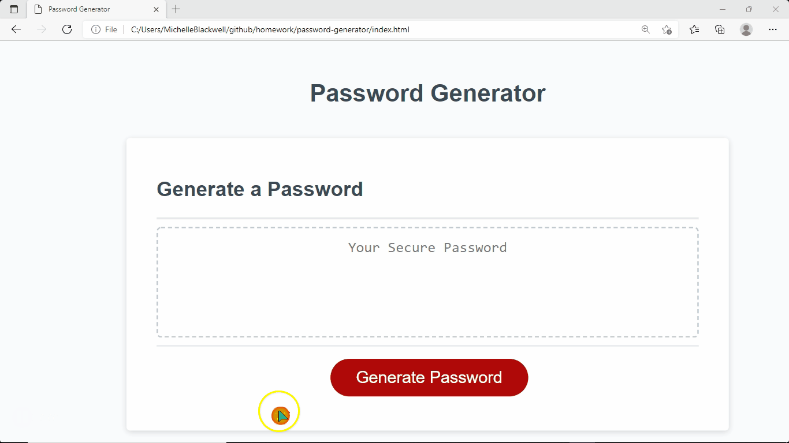

# password-generator
Modify starter code to create an application that enables employees to generate random passwords based on criteria that they’ve selected. This app will run in the browser and will feature dynamically updated HTML and CSS powered by JavaScript code.

## Live Links

## Description
To randomly generate a password that meets certain criteria to create strong passwords on demand, for greater security.

## Usage
1. User will click the button "generate a password"
2. After clicking the button, user will be prompted with questions to create a random secure password.

## Criteria 
GIVEN I need a new, secure password
* WHEN I click the button to generate a password
    * THEN I am presented with a series of prompts for password criteria
* WHEN prompted for password criteria
    * THEN I select which criteria to include in the password
* WHEN prompted for the length of the password
    * THEN I choose a length of at least 8 characters and no more than 128 characters
* WHEN asked for character types to include in the password
    * THEN I confirm whether or not to include lowercase, uppercase, numeric, and/or special characters
* WHEN I answer each prompt
    * THEN my input should be validated and at least one character type should be selected
* WHEN all prompts are answered
    * THEN a password is generated that matches the selected criteria
* WHEN the password is generated
    * THEN the password is either displayed in an alert or written to the page

3. Upon answering the prompts the password will generate and appear in the box. 

## Credits:
* Sandra Smith
* Christopher Ponzio https://github.com/ChristopherPonzio

## License:
MIT License